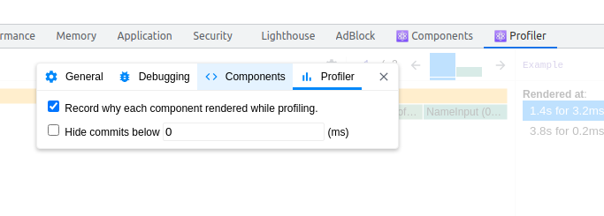
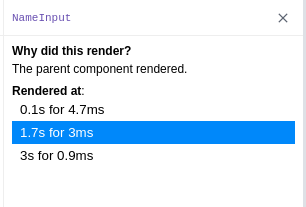
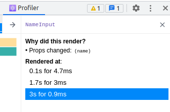

<div>
  <h1 align="center"><a href="https://epicreact.dev/performance">⚡ React Performance 🚀 EpicReact.Dev</a></h1>
  <strong>
    React is fast, until it isn't
  </strong>
  <p>
    Learn everything you need to diagnose, profile, and fix performance problems
    in your React application using the Browser Performance Profiler,
    React DevTools Profiler, and proven React optimization techniques.
  </p>

  <a href="https://epicreact.dev">
    
  </a>
</div>

<hr />

<!-- prettier-ignore-start -->
[![Build Status][build-badge]][build]
[![All Contributors][all-contributors-badge]](#contributors)
[![GPL 3.0 License][license-badge]][license]
[![Code of Conduct][coc-badge]][coc]
<!-- prettier-ignore-end -->

## Prerequisites

- Install the React DevTools
  ([Chrome](https://chrome.google.com/webstore/detail/react-developer-tools/fmkadmapgofadopljbjfkapdkoienihi?hl=en)
  (recommended),
  [Firefox](https://addons.mozilla.org/en-US/firefox/addon/react-devtools/))
- Experience with React and all hooks

## System Requirements

- [git][git] v2.13 or greater
- [NodeJS][node] `12 || 14 || 15 || 16`
- [npm][npm] v6 or greater

All of these must be available in your `PATH`. To verify things are set up
properly, you can run this:

```shell
git --version
node --version
npm --version
```

If you have trouble with any of these, learn more about the PATH environment
variable and how to fix it here for [windows][win-path] or
[mac/linux][mac-path].

## Setup

> If you want to commit and push your work as you go, you'll want to
> [fork](https://docs.github.com/en/free-pro-team@latest/github/getting-started-with-github/fork-a-repo)
> first and then clone your fork rather than this repo directly.

After you've made sure to have the correct things (and versions) installed, you
should be able to just run a few commands to get set up:

```
git clone https://github.com/kentcdodds/react-performance.git
cd react-performance
node setup
```

This may take a few minutes. **It will ask you for your email.** This is
optional and just automatically adds your email to the links in the project to
make filling out some forms easier.

If you get any errors, please read through them and see if you can find out what
the problem is. If you can't work it out on your own then please [file an
issue][issue] and provide _all_ the output from the commands you ran (even if
it's a lot).

If you can't get the setup script to work, then just make sure you have the
right versions of the requirements listed above, and run the following commands:

```
npm install
npm run validate
```

If you are still unable to fix issues and you know how to use Docker 🐳 you can
setup the project with the following command:

```
docker-compose up
```

It's recommended you run everything locally in the same environment you work in
every day, but if you're having issues getting things set up, you can also set
this up using [GitHub Codespaces](https://github.com/features/codespaces)
([video demo](https://www.youtube.com/watch?v=gCoVJm3hGk4)) or
[Codesandbox](https://codesandbox.io/s/github/kentcdodds/react-performance).

## Running the app

To get the app up and running (and really see if it worked), run:

```shell
npm start
```

This should start up your browser. If you're familiar, this is a standard
[react-scripts](https://create-react-app.dev/) application.

You can also open
[the deployment of the app on Netlify](https://react-performance.netlify.app/).

## Running the tests

```shell
npm test
```

This will start [Jest](https://jestjs.io/) in watch mode. Read the output and
play around with it. The tests are there to help you reach the final version,
however _sometimes_ you can accomplish the task and the tests still fail if you
implement things differently than I do in my solution, so don't look to them as
a complete authority.

### Exercises

- `src/exercise/00.md`: Background, Exercise Instructions, Extra Credit
- `src/exercise/00.js`: Exercise with Emoji helpers
- `src/__tests__/00.js`: Tests
- `src/final/00.js`: Final version
- `src/final/00.extra-0.js`: Final version of extra credit

The purpose of the exercise is **not** for you to work through all the material.
It's intended to get your brain thinking about the right questions to ask me as
_I_ walk through the material.

### Helpful Emoji 🐨 💰 💯 📝 🦉 📜 💣 💪 🏁 👨‍💼 🚨

Each exercise has comments in it to help you get through the exercise. These fun
emoji characters are here to help you.

- **Kody the Koala** 🐨 will tell you when there's something specific you should
  do version
- **Marty the Money Bag** 💰 will give you specific tips (and sometimes code)
  along the way
- **Hannah the Hundred** 💯 will give you extra challenges you can do if you
  finish the exercises early.
- **Nancy the Notepad** 📝 will encourage you to take notes on what you're
  learning
- **Olivia the Owl** 🦉 will give you useful tidbits/best practice notes and a
  link for elaboration and feedback.
- **Dominic the Document** 📜 will give you links to useful documentation
- **Berry the Bomb** 💣 will be hanging around anywhere you need to blow stuff
  up (delete code)
- **Matthew the Muscle** 💪 will indicate that you're working with an exercise
- **Chuck the Checkered Flag** 🏁 will indicate that you're working with a final
- **Peter the Product Manager** 👨‍💼 helps us know what our users want
- **Alfred the Alert** 🚨 will occasionally show up in the test failures with
  potential explanations for why the tests are failing.

## Notes

**Code Splitting** - Code splitting acts on the principle that loading less code
will speed up your app. Say for example that we’re building a complex dashboard
application that includes the venerable d3 library for graphing data. Your users
start complaining because it takes too long to load the login screen.

**Built-in javascript dynamic import**

```js
import('/some-module.js').then(
  module => {
    // do stuff with the module's exports
  },
  error => {
    // there was some error loading the module...
  },
)
```

**React way of loading modules**

```js
// smiley-face.js
import * as React from 'react'

function SmileyFace() {
  return <div>😃</div>
}

export default SmileyFace

// app.js
import * as React from 'react'

const SmileyFace = React.lazy(() => import('./smiley-face'))

function App() {
  return (
    <div>
      <React.Suspense fallback={<div>loading...</div>}>
        <SmileyFace />
      </React.Suspense>
    </div>
  )
}
```

- We may also want to try running the production build so you can see what the
  sizes are like post-minification: Run `npm run build` and then
  `npm run serve`.

- The component that are going to be lazy loaded need to be exported as default!
- The `<React.Suspense />` component for the current version of React can be
  anywhere as long it is a parent of the lazy loaded component (it will only
  work when attempting to load the lazy loaded component). Altough, in the
  future with concurrent mode, we want to avoid putting it conditional (inside a
  State for example, because it can take a certain ammount of time to get the
  fallback to appear)

```js
<div style={{width: 400, height: 400}}>
  <React.Suspense fallback={<div>loading...</div>}>
    {showGlobe ? <Globe /> : null}
  </React.Suspense>
</div>
```

- Dev tools tip: In components tab we can select a component and click on the
  StopWatch button to suspense/unsuspend the component, and see the
  `<React.Suspense />` behavior:


- We can have the `<React.Suspense />` wrapping the whole component, this will
  mean all the lazy loaded components will reuse the same `<React.Suspense />`,
  because it will get the first parent, this is good if we want to have
  multiples components using only one `<React.Suspense />`

**Eager Loading** - Technique to pre-load heavy components so the user can have
it loaded when he needs (usually using `onMouseOver`, `onMouseEnter` or `focus`
we kick off a dynamic import)

```js
<label style={{marginBottom: '1rem'}} onMouseOver={() => import('../globe')}>
  <input
    type="checkbox"
    checked={showGlobe}
    onChange={e => setShowGlobe(e.target.checked)}
  />
  {' show globe'}
</label>
```

**Webpack Magic Components** - We can use
[magic comments](https://webpack.js.org/api/module-methods/#magic-comments) to
make webpack add things to the document's `head` and instruct the browser to
prefetch dynamic imports

```js
import(/* webpackPrefetch: true */ './some-module.js')
```

When webpack sees this comment, it adds this to your document’s head:

`<link rel="prefetch" as="script" href="/static/js/1.chunk.js">``

- With this, the browser will automatically load this JavaScript file into the
  browser cache so it’s ready ahead of time.

- We can use the `webpackChunkName` magic comment which will allow webpack to
  place common modules in the same chunk. This is good for components which you
  want loaded together in the same chunk (to reduce multiple requests for
  multiple modules which will likely be needed together).

```js
const One = React.lazy(() =>
  import(/* webpackChunkName: "group" */ './group/one'),
)
const Two = React.lazy(() =>
  import(/* webpackChunkName: "group" */ './group/two'),
)
```

**The Coverage Tool** We can use the browser's coverage tool, to analyze how
much code we are loading at the initial load that we are not using


- A tip when doing optimization is to leverage on production code, not
  development, and compare the previous version with the current, because we
  might not always have a 100% optmized code splitting

- The red is the unused code, if we click we will have the code with the lines
  in red and blue

- Use incognito to prevent your extensions to affect your coverage

**useMemo** - Our component's calculations performed within render will be
performed every single render, regardless of whether the inputs for the
calculations change. For example:

```js
function Distance({x, y}) {
  const distance = calculateDistance(x, y)
  return (
    <div>
      The distance between {x} and {y} is {distance}.
    </div>
  )
}
```

If that component’s parent re-renders, or if we add some unrelated state to the
component and trigger a re-render, we’ll be calling calculateDistance every
render which could lead to a performance bottleneck.

This is why we have the useMemo hook from React:

```js
function Distance({x, y}) {
  const distance = React.useMemo(() => calculateDistance(x, y), [x, y])
  return (
    <div>
      The distance between {x} and {y} is {distance}.
    </div>
  )
}
```

- Also, in React docs, it says is not always guaranteed the value to be
  memoized, because React can choose to free some memory by getting rid of some
  memoized values, but usually, we don't need to take that into account.

- A good aim for performance, is to have 60 frames a second, which is where we
  have a nice smooth experience for the human eye, then you need to nail 16
  frames a second, that is 1,000 divided by 60 frames a second. That's going to
  be 16 milliseconds, thereabouts, for your JavaScript to run so that the
  browser can keep up and not drop any frames and resulting in a janky
  experience.
- So we aim, our JavaScript to run in 16 milliseconds, or it's still not super
  awesome.

**Always compare runing production mode** : `npm run build` then `npm run serve`

**Web Workers** - We can use Web Workers to put slow functions run in a thread
appart from the main thread, that can help us with performance because the main
thread is not interrupted to execute the slow function, we just need a way to
work asynchronous with the web worker's data

```js
const {data: allItems, run} = useAsync()

React.useEffect(() => {
  run(getItems(inputValue))
}, [inputValue, run])
```

- `workerize` is a package that makes using web workers easier: and have the
  `workerize-loader` which is a webpack loader for workerize which basically
  means you can put any module (and the modules that it imports) into a
  webworker.

```js
// eslint-disable-next-line import/no-webpack-loader-syntax
import makeFilterCitiesWorker from 'workerize!./filter-cities'
const {getItems} = makeFilterCitiesWorker()
export {getItems}
```

- The workerize! thing in the import statement is a fancy webpack syntax to tell
  webpack to treat that module specially (specifically to pipe it through the
  workerize-loader so Jason can do his magic on it to get it into a web worker).

**Lifecycle of React**

```
→  render → reconciliation → commit
         ↖                   ↙
              state change
```

- “render” phase: create React elements React.createElement
- “reconciliation” phase: compare previous elements with the new ones
- “commit” phase: update the DOM (if needed).

A React Component can re-render for any of the following reasons:

- Its props change
- Its internal state changes
- It is consuming context values which have changed
- Its parent re-renders

We can opt-out of state updates for a part of the React tree by using one of
React’s built-in rendering bail-out utilities: `React.PureComponent`,
`React.memo`, or `shouldComponentUpdate`.

Using one of the bail-out APIs, you can instruct React when to re-render.
`React.PureComponent` is for class components and `React.memo` is for function
components and they do basically the same thing by default. They make it so your
component will not re-render simply because its parent re-rendered which could
improve the performance of your app overall.

**React.memo** example:

```js
function CountButton({count, onClick}) {
  return <button onClick={onClick}>{count}</button>
}

function NameInput({name, onNameChange}) {
  return (
    <label>
      Name: <input value={name} onChange={e => onNameChange(e.target.value)} />
    </label>
  )
}

function Example() {
  const [name, setName] = React.useState('')
  const [count, setCount] = React.useState(0)
  const increment = () => setCount(c => c + 1)
  return (
    <div>
      <div>
        <CountButton count={count} onClick={increment} />
      </div>
      <div>
        <NameInput name={name} onNameChange={setName} />
      </div>
      {name ? <div>{`${name}'s favorite number is ${count}`}</div> : null}
    </div>
  )
}
```

Based on how this is implemented, when you click on the counter button, the
`<CountButton />` re-renders (so we can update the count value). But the
`<NameInput />` is also re-rendered. If you have Record why each component
rendered while profiling. enabled in React DevTools, then you’ll see that under
“Why did this render?” it says "The parent component rendered."

```js
function CountButton({count, onClick}) {
  return <button onClick={onClick}>{count}</button>
}

function NameInput({name, onNameChange}) {
  return (
    <label>
      Name: <input value={name} onChange={e => onNameChange(e.target.value)} />
    </label>
  )
}
NameInput = React.memo(NameInput)

// etc... no other changes necessary
```

Alternative ways of using `React.memo`:

```js
const NameInput = React.memo(({name, onNameChange}) => {
  return (
    <label>
      Name: <input value={name} onChange={e => onNameChange(e.target.value)} />
    </label>
  )
})
// But this is not so good because it won't print the name of the function in the Dev tools
```

```js
const NameInput = React.memo(function NameInput({name, onNameChange}) {
  return (
    <label>
      Name: <input value={name} onChange={e => onNameChange(e.target.value)} />
    </label>
  )
})
// This will print the name of the function in the Dev tools, but does not looks nice
```

- **React.memo** accepts a second argument which is a custom compare function
  that allows us to compare the props and return true if rendering the component
  again is unnecessary and false if it is necessary.

- If it returns `true`, it won't rerender, if returns `false` it will

> Without the first argument, the default behaviour of `React.memo` is to
> compare each previous prop againts the next prop

I.e:

```js
// 🐨 Memoize the ListItem here using React.memo
ListItem = React.memo(ListItem, (prevProps, nextProps) => {
  // rerender if the highlightindex is the current one (to apply current item selection)
  /*
  // Default behavior:
  if (prevProps.getItemProps !== nextProps.getItemProps) return false  
  if (prevProps.items !== nextProps.items) return false  
  if (prevProps.index !== nextProps.index) return false  
  if (prevProps.selectedItem !== nextProps.selectedItem) return false  
  if (prevProps.highlightedIndex !== nextProps.highlightedIndex) return false  
  return true
  */
  if (nextProps.highlightedIndex === nextProps.index) {
    return false
  }
  // rerender if the highlightexindex was the previous one (to clear previous item selection)
  if (prevProps.highlightedIndex === prevProps.index) {
    return false
  }

  // otherwise, don't need to rerender
  return true
})
```

> **Note:** Even better is to not have to provide our custom memoization
> comparator function and still get the perf gains? Definitely! So an
> alternative approach is to pass the pre-computed values for isSelected and
> isHighlighted to our ListItem. That way they are primitive values and we can
> take advantage of React’s built-in comparison function and remove ours
> altogether.

```js
<ul {...getMenuProps()}>
  {items.map((item, index) => {
    const isSelected = selectedItem?.id === item.id
    const isHighlighted = highlightedIndex === index

    return (
      <ListItem
        key={item.id}
        getItemProps={getItemProps}
        item={item}
        index={index}
        // selectedItem={selectedItem}
        isSelected={isSelected}
        isHighlighted={isHighlighted}
        // highlightedIndex={highlightedIndex}
      >
        {item.name}
      </ListItem>
    )
  })}
</ul>
```

### Useful Profiler Tips

**Enable Why each component rendered while profiling**

|  |
| :--------------------------------------------: |
|    Click on the Cog Icon to go to settings     |

|  |
| :--------------------------------------------: |
|      Example showing why did this render       |

|  |
| :--------------------------------------------: |
|  The chart columns displayed are the commits   |

### Premises

- "Fix the slow render before you fix the unnecessary rerender"
  [Kent C Dodds](https://kentcdodds.com/blog/fix-the-slow-render-before-you-fix-the-re-render)

- Avoid the mistake of wrapping everything in `React.memo` which can actually
  slow down your app in some cases and in all cases it makes your code more
  complex.

### Windowing

- We can use [react-virtual](https://github.com/tannerlinsley/react-virtual) to
  create a virtualized list with react
- The idea of virtualization is to render only a subset of the list items. This
  is useful when the list is very long and you don’t need to render all of it.
- We also play with calculated style heights to keep using the original
  scrollbar

### Context

The way context works is that whenever the provided value changes from one
render to another, it triggers a re-render of all the consuming components (even
if they're memoized). Ex.

```js
const CountContext = React.createContext()

function CountProvider(props) {
  const [count, setCount] = React.useState(0)
  const value = [count, setCount]
  return <CountContext.Provider value={value} {...props} />
}
```

Every time the `<CountProvider />` re-renders, the `value` is brand new, so all
consumers will be re-rendered. The easiest way to avoid this is to use
`React.useMemo()`:

```js
const CountContext = React.createContext()

function CountProvider(props) {
  const [count, setCount] = React.useState(0)
  const value = React.useMemo(() => [count, setCount], [count])
  return <CountContext.Provider value={value} {...props} />
}
```

- _Note:_ We can have multiple contexts wrapped by a single component, because,
  only the specific consumers will get re-rendered.

```js
function AppProvider({children}) {
  const [state, dispatch] = React.useReducer(appReducer, {
    dogName: '',
    grid: initialGrid,
  })
  return (
    <AppStateContext.Provider value={state}>
      <DispatcherContext.Provider value={dispatch}>
        {children}
      </DispatcherContext.Provider>
    </AppStateContext.Provider>
  )
}

// Only the specifics consumers for AppStateContext and DispatcherContext will get re-rendered when state or dispatch changes
```

_Performance death by a thousand cuts:_ when lots of components need to run when
there’s a state update, which basically means that so many components are
updated when state changes that it becomes a performance bottleneck.

Usually it can be solved with less code, reducing component complexity, or often
you have components responding to state change that don't need to. We can
memoize with `React.memo` or we can use
[colocation](https://kentcdodds.com/blog/state-colocation-will-make-your-react-app-faster),
and move state inside or closer as possible with the components instead of
placing in a global state.

- Another alternative solution is to split logic into two differents context, if
  for some reason we need to have a global state.
- Another solution is create a man in the middle component, which will consume
  the state and have the Impl component memoized, so it will only rerender if
  needed!

```js
function Cell({row, column}) {
  const state = useAppState()
  const cell = state.grid[row][column]

  return <CellImpl cell={cell} row={row} column={column} />
}
Cell = React.memo(Cell)

function CellImpl({cell, row, column}) {
  const dispatch = useAppDispatch()
  const handleClick = () => dispatch({type: 'UPDATE_GRID_CELL', row, column})

  return (
    <button
      className="cell"
      onClick={handleClick}
      style={{
        color: cell > 50 ? 'white' : 'black',
        backgroundColor: `rgba(0, 0, 0, ${cell / 100})`,
      }}
    >
      {Math.floor(cell)}
    </button>
  )
}
CellImpl = React.memo(CellImpl)
```

- A more generic solution using HOC would be:

```js
function withStateSlice(Component, slice) {
  const MemoizedComponent = React.memo(Component)
  function Wrapper(props) {
    const state = useAppState()
    return <MemoizedComponent state={slice(state, props)} {...props} />
  }

  Wrapper.displayName = `withStateSlice(${
    Component.displayName || Component.name
  })`
  return React.memo(Wrapper)
}

function Cell({state: cell, row, column}) {
  const dispatch = useAppDispatch()
  const handleClick = () => dispatch({type: 'UPDATE_GRID_CELL', row, column})

  return (
    <button
      className="cell"
      onClick={handleClick}
      style={{
        color: cell > 50 ? 'white' : 'black',
        backgroundColor: `rgba(0, 0, 0, ${cell / 100})`,
      }}
    >
      {Math.floor(cell)}
    </button>
  )
}
Cell = withStateSlice(Cell, (state, {row, column}) => state.grid[row][column])
```

## Contributors

Thanks goes to these wonderful people
([emoji key](https://github.com/kentcdodds/all-contributors#emoji-key)):

<!-- ALL-CONTRIBUTORS-LIST:START - Do not remove or modify this section -->
<!-- prettier-ignore-start -->
<!-- markdownlint-disable -->
<table>
  <tr>
    <td align="center"><a href="https://kentcdodds.com"><br /><sub><b>Kent C. Dodds</b></sub></a><br /><a href="https://github.com/kentcdodds/react-performance/commits?author=kentcdodds" title="Code">💻</a> <a href="https://github.com/kentcdodds/react-performance/commits?author=kentcdodds" title="Documentation">📖</a> <a href="#infra-kentcdodds" title="Infrastructure (Hosting, Build-Tools, etc)">🚇</a> <a href="https://github.com/kentcdodds/react-performance/commits?author=kentcdodds" title="Tests">⚠️</a></td>
    <td align="center"><a href="https://stackshare.io/jdorfman/decisions"><br /><sub><b>Justin Dorfman</b></sub></a><br /><a href="#fundingFinding-jdorfman" title="Funding Finding">🔍</a></td>
    <td align="center"><a href="https://bol.vin"><br /><sub><b>Frédéric Bolvin</b></sub></a><br /><a href="https://github.com/kentcdodds/react-performance/commits?author=Fensterbank" title="Documentation">📖</a></td>
    <td align="center"><a href="http://vojta.io"><br /><sub><b>Vojta Holik</b></sub></a><br /><a href="https://github.com/kentcdodds/react-performance/commits?author=vojtaholik" title="Code">💻</a> <a href="#design-vojtaholik" title="Design">🎨</a></td>
    <td align="center"><a href="https://github.com/marcosvega91"><br /><sub><b>Marco Moretti</b></sub></a><br /><a href="https://github.com/kentcdodds/react-performance/commits?author=marcosvega91" title="Code">💻</a></td>
    <td align="center"><a href="https://ricardobusquet.com"><br /><sub><b>Ricardo Busquet</b></sub></a><br /><a href="https://github.com/kentcdodds/react-performance/commits?author=rbusquet" title="Code">💻</a></td>
    <td align="center"><a href="https://github.com/nywleswoey"><br /><sub><b>Selwyn Yeow</b></sub></a><br /><a href="https://github.com/kentcdodds/react-performance/commits?author=nywleswoey" title="Code">💻</a></td>
  </tr>
  <tr>
    <td align="center"><a href="https://github.com/emzoumpo"><br /><sub><b>Emmanouil Zoumpoulakis</b></sub></a><br /><a href="https://github.com/kentcdodds/react-performance/commits?author=emzoumpo" title="Documentation">📖</a></td>
    <td align="center"><a href="http://peter.hozak.info/"><br /><sub><b>Peter Hozák</b></sub></a><br /><a href="https://github.com/kentcdodds/react-performance/commits?author=Aprillion" title="Code">💻</a></td>
    <td align="center"><a href="https://www.linkedin.com/in/pritamsangani/"><br /><sub><b>Pritam Sangani</b></sub></a><br /><a href="https://github.com/kentcdodds/react-performance/commits?author=PritamSangani" title="Code">💻</a></td>
    <td align="center"><a href="https://github.com/milamer"><br /><sub><b>Christian Schurr</b></sub></a><br /><a href="https://github.com/kentcdodds/react-performance/commits?author=milamer" title="Code">💻</a> <a href="https://github.com/kentcdodds/react-performance/commits?author=milamer" title="Documentation">📖</a></td>
    <td align="center"><a href="https://magrippis.com"><br /><sub><b>Johnny Magrippis</b></sub></a><br /><a href="https://github.com/kentcdodds/react-performance/commits?author=jmagrippis" title="Code">💻</a></td>
    <td align="center"><a href="https://github.com/AhmedAymanM"><br /><sub><b>Ahmed</b></sub></a><br /><a href="https://github.com/kentcdodds/react-performance/commits?author=AhmedAymanM" title="Code">💻</a> <a href="https://github.com/kentcdodds/react-performance/commits?author=AhmedAymanM" title="Documentation">📖</a></td>
    <td align="center"><a href="https://github.com/RobbertWolfs"><br /><sub><b>Robbert Wolfs</b></sub></a><br /><a href="https://github.com/kentcdodds/react-performance/commits?author=RobbertWolfs" title="Documentation">📖</a></td>
  </tr>
  <tr>
    <td align="center"><a href="https://www.gwanduke.com"><br /><sub><b>Kim Gwan-duk</b></sub></a><br /><a href="https://github.com/kentcdodds/react-performance/commits?author=gwanduke" title="Documentation">📖</a></td>
    <td align="center"><a href="https://rasmusjosefsson.com"><br /><sub><b>Rasmus Josefsson</b></sub></a><br /><a href="https://github.com/kentcdodds/react-performance/commits?author=rajjejosefsson" title="Code">💻</a></td>
    <td align="center"><a href="https://github.com/MarcosNASA"><br /><sub><b>Marcos NASA G</b></sub></a><br /><a href="https://github.com/kentcdodds/react-performance/commits?author=MarcosNASA" title="Documentation">📖</a></td>
    <td align="center"><a href="https://github.com/Snaptags"><br /><sub><b>Markus Lasermann</b></sub></a><br /><a href="https://github.com/kentcdodds/react-performance/commits?author=Snaptags" title="Documentation">📖</a></td>
    <td align="center"><a href="https://vk.com/vasilii_kovalev"><br /><sub><b>Vasilii Kovalev</b></sub></a><br /><a href="https://github.com/kentcdodds/react-performance/commits?author=vasilii-kovalev" title="Documentation">📖</a></td>
    <td align="center"><a href="https://github.com/matchai"><br /><sub><b>Matan Kushner</b></sub></a><br /><a href="https://github.com/kentcdodds/react-performance/commits?author=matchai" title="Documentation">📖</a></td>
    <td align="center"><a href="https://michaeldeboey.be"><br /><sub><b>Michaël De Boey</b></sub></a><br /><a href="https://github.com/kentcdodds/react-performance/commits?author=MichaelDeBoey" title="Code">💻</a></td>
  </tr>
  <tr>
    <td align="center"><a href="http://www.veljkoblagojevic.com"><br /><sub><b>Veljko Blagojevic</b></sub></a><br /><a href="https://github.com/kentcdodds/react-performance/commits?author=Wekios" title="Documentation">📖</a></td>
    <td align="center"><a href="http://bobbywarner.com"><br /><sub><b>Bobby Warner</b></sub></a><br /><a href="https://github.com/kentcdodds/react-performance/commits?author=bobbywarner" title="Code">💻</a></td>
    <td align="center"><a href="http://angular-tips.com"><br /><sub><b>Jesús Rodríguez</b></sub></a><br /><a href="https://github.com/kentcdodds/react-performance/commits?author=Foxandxss" title="Documentation">📖</a></td>
    <td align="center"><a href="https://valentin-hervieu.fr"><br /><sub><b>Valentin Hervieu</b></sub></a><br /><a href="https://github.com/kentcdodds/react-performance/issues?q=author%3AValentinH" title="Bug reports">🐛</a></td>
    <td align="center"><a href="https://davsanchez.com"><br /><sub><b>David Sánchez</b></sub></a><br /><a href="https://github.com/kentcdodds/react-performance/commits?author=d4vsanchez" title="Documentation">📖</a></td>
    <td align="center"><a href="http://merott.com"><br /><sub><b>Merott Movahedi</b></sub></a><br /><a href="https://github.com/kentcdodds/react-performance/commits?author=Merott" title="Documentation">📖</a></td>
    <td align="center"><a href="https://www.arjenbloemsma.nl"><br /><sub><b>Arjen Bloemsma</b></sub></a><br /><a href="https://github.com/kentcdodds/react-performance/commits?author=arjenbloemsma" title="Documentation">📖</a></td>
  </tr>
  <tr>
    <td align="center"><a href="https://www.linkedin.com/in/syed-naveed-elahi/"><br /><sub><b>Naveed Elahi</b></sub></a><br /><a href="https://github.com/kentcdodds/react-performance/commits?author=BboyStatix" title="Documentation">📖</a></td>
    <td align="center"><a href="http://tknappe.com/"><br /><sub><b>Tyler Knappe</b></sub></a><br /><a href="https://github.com/kentcdodds/react-performance/commits?author=knappe" title="Documentation">📖</a></td>
    <td align="center"><a href="https://github.com/0xnoob"><br /><sub><b>0xnoob</b></sub></a><br /><a href="https://github.com/kentcdodds/react-performance/commits?author=0xnoob" title="Code">💻</a> <a href="https://github.com/kentcdodds/react-performance/commits?author=0xnoob" title="Documentation">📖</a></td>
  </tr>
</table>

<!-- markdownlint-restore -->
<!-- prettier-ignore-end -->

<!-- ALL-CONTRIBUTORS-LIST:END -->

This project follows the
[all-contributors](https://github.com/kentcdodds/all-contributors)
specification. Contributions of any kind welcome!

## Workshop Feedback

Each exercise has an Elaboration and Feedback link. Please fill that out after
the exercise and instruction.

At the end of the workshop, please go to this URL to give overall feedback.
Thank you! https://kcd.im/rp-ws-feedback

<!-- prettier-ignore-start -->
[npm]: https://www.npmjs.com/
[node]: https://nodejs.org
[git]: https://git-scm.com/
[build-badge]: https://img.shields.io/github/workflow/status/kentcdodds/react-performance/validate/main?logo=github&style=flat-square
[build]: https://github.com/kentcdodds/react-performance/actions?query=workflow%3Avalidate
[license-badge]: https://img.shields.io/badge/license-GPL%203.0%20License-blue.svg?style=flat-square
[license]: https://github.com/kentcdodds/react-performance/blob/main/LICENSE
[coc-badge]: https://img.shields.io/badge/code%20of-conduct-ff69b4.svg?style=flat-square
[coc]: https://github.com/kentcdodds/react-performance/blob/main/CODE_OF_CONDUCT.md
[emojis]: https://github.com/kentcdodds/all-contributors#emoji-key
[all-contributors]: https://github.com/kentcdodds/all-contributors
[all-contributors-badge]: https://img.shields.io/github/all-contributors/kentcdodds/react-performance?color=orange&style=flat-square
[win-path]: https://www.howtogeek.com/118594/how-to-edit-your-system-path-for-easy-command-line-access/
[mac-path]: http://stackoverflow.com/a/24322978/971592
[issue]: https://github.com/kentcdodds/react-performance/issues/new
<!-- prettier-ignore-end -->
